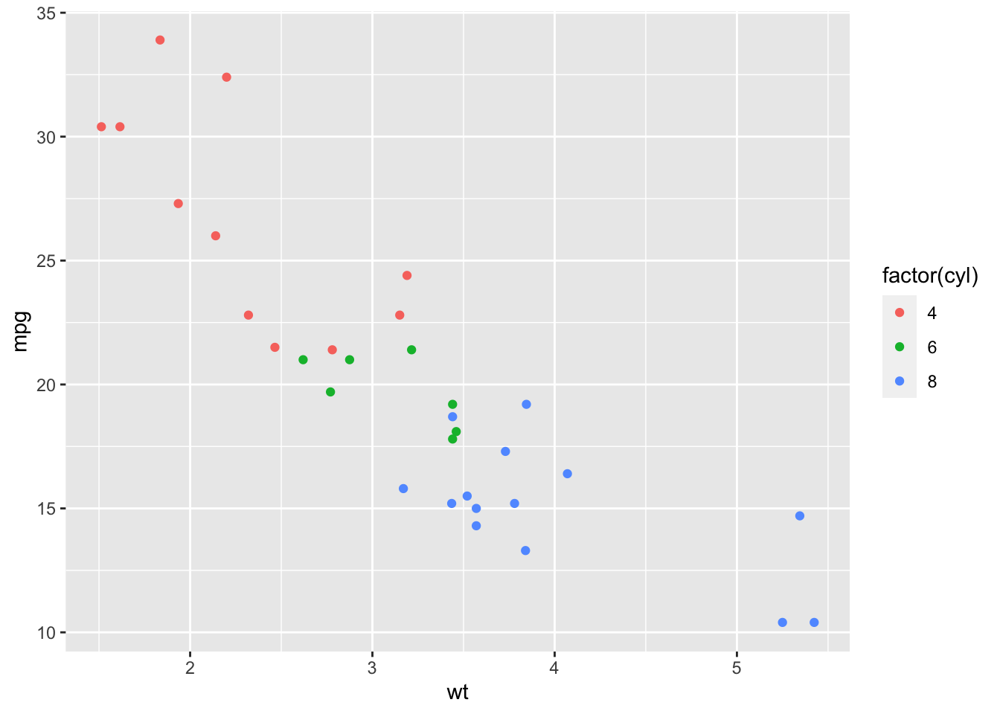
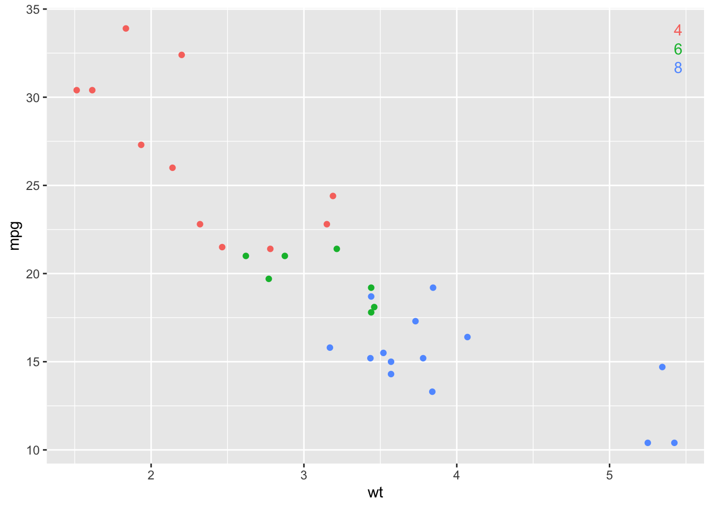
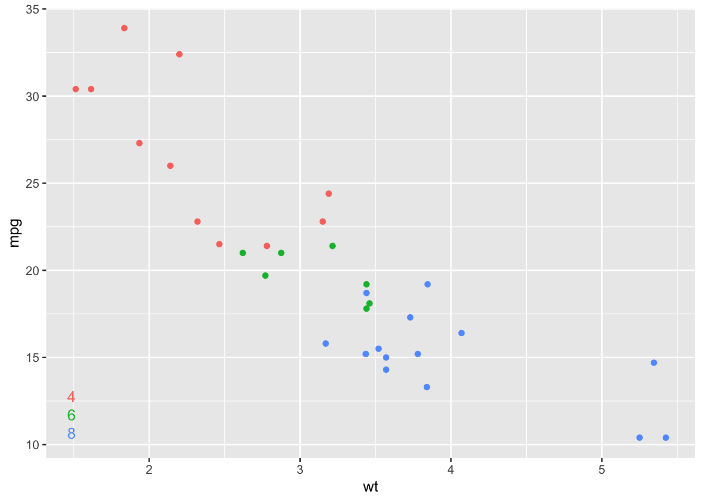
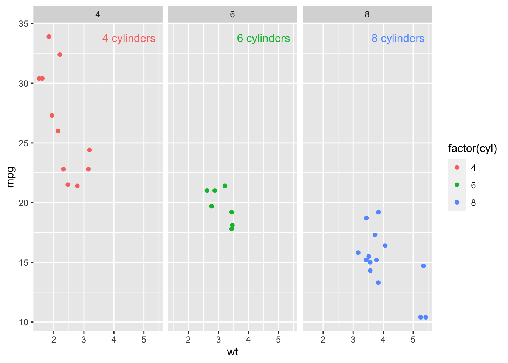

<!-- README.md is generated from README.Rmd. Please edit that file -->

# ggdirectlabel

<!-- badges: start -->

[](https://github.com/MattCowgill/ggdirectlabel/actions)
[](https://lifecycle.r-lib.org/articles/stages.html#experimental)
[](https://github.com/MattCowgill/ggdirectlabel/actions/workflows/R-CMD-check.yaml)
<!-- badges: end -->

The goal of ggdirectlabel is to make it easier to directly label ggplot2
charts rather than using legends.

## Installation

You can install the development version of ggdirectlabel from
[GitHub](https://github.com/) with:

``` r
# install.packages("devtools")
devtools::install_github("MattCowgill/ggdirectlabel")
```

``` r
library(ggdirectlabel)
library(ggplot2)
library(magrittr)
```

## Using `geom_richlegend()`

Here’s a standard ggplot2 scatterplot:

``` r
base_scatter <- mtcars |> 
  ggplot(aes(x = wt, y = mpg, col = factor(cyl))) +
  geom_point()

base_scatter
```



This is fine! But sometimes you might like the legend levels (4, 6, and
8 in this example) to be coloured according to the levels in the data.
That’s where `geom_richlegend()` comes in:

``` r
base_scatter +
  geom_richlegend(aes(label = cyl)) +
  theme(legend.position = "none")
```



You can move the ‘rich legend’ around:

``` r
base_scatter +
  geom_richlegend(aes(label = cyl),
                  legend.position = "bottomleft",
                  vjust = 0,
                  hjust = 0) +
  theme(legend.position = "none")
```



`geom_richlegend()` respects facets - it’ll place a little legend
annotation for each level of the data that appears in that panel:

``` r
base_scatter +
  geom_richlegend(aes(label = paste0(cyl, " cylinders"))) +
  facet_wrap(~cyl)
```



## Using `geom_linepoint()`

Without ggirectlabel, we might do something like:

``` r

ggplot2::economics_long %>%
  ggplot(aes(x = date, y = value, col = variable)) +
  geom_line() +
  geom_point(data = ~dplyr::filter(., date == max(date)),
             fill = "white",
             shape = 21,
             size = 2.5,
             stroke = 1.25)
```


This is fine! But this is a more straightforward way to achieve the same
thing:

``` r
ggplot2::economics_long %>%
  ggplot(aes(x = date, y = value, col = variable)) +
  geom_linepoint()
```


## Using `scale_x_date_rightalign()`

In time series line charts, it’s often important to make clear the date
of your most recent observation. The `scale_x_date_rightalign()`
function aligns the breaks of your x-axis so that the most recent
observation is included in the breaks.

``` r
ggplot2::economics_long %>%
  ggplot(aes(x = date, y = value, col = variable)) +
  geom_linepoint() +
  scale_x_date_rightalign()
```


## Using `geom_finallabel()`

In time series line charts, you may wish to label the final point in the
series. The `geom_finallabel()` function makes that easy.

``` r
ggplot2::economics_long %>%
  ggplot(aes(x = date, y = value, col = variable)) +
  geom_linepoint() +
  geom_finallabel(aes(label = round(value, 0))) +
  scale_x_date_rightalign(expand = expansion(c(0, 0.15))) +
  theme(legend.position = "none")
```


