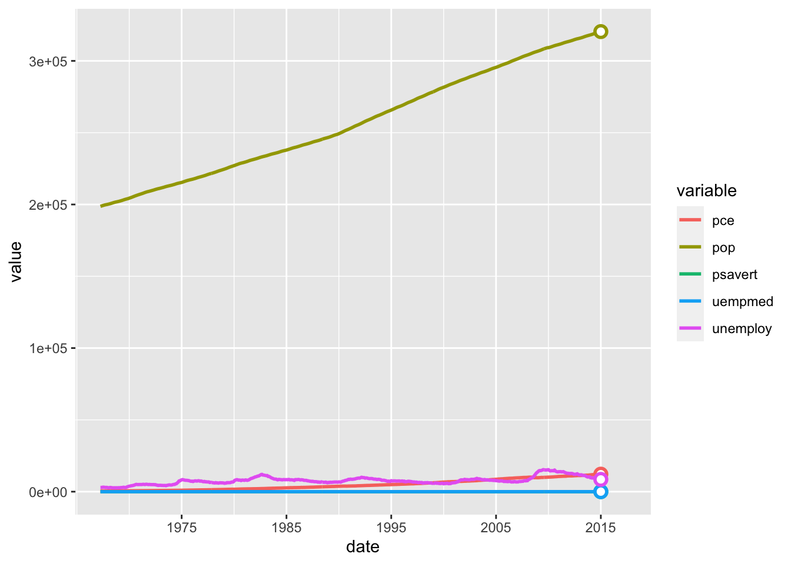
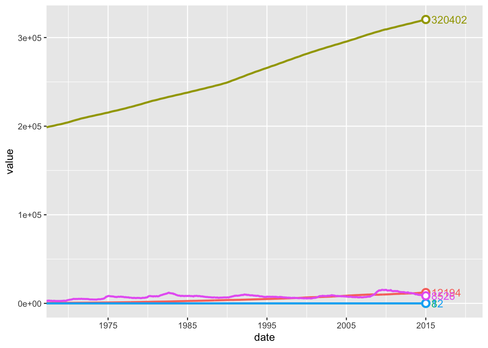

<!-- README.md is generated from README.Rmd. Please edit that file -->

# ggdirectlabel

<!-- badges: start -->

[](https://github.com/MattCowgill/ggdirectlabel/actions)
[](https://lifecycle.r-lib.org/articles/stages.html#experimental)
[](https://github.com/MattCowgill/ggdirectlabel/actions/workflows/R-CMD-check.yaml)
<!-- badges: end -->

The goal of ggdirectlabel is to make it easier to directly label ggplot2
charts rather than using legends.

## Installation

You can install the development version of ggdirectlabel from
[GitHub](https://github.com/) with:

``` r
# install.packages("devtools")
devtools::install_github("MattCowgill/ggdirectlabel")
```

## Using `geom_linepoint()`

Without ggirectlabel, we might do something like:

``` r
library(ggplot2)
library(magrittr)
theme_set(theme_minimal())

ggplot2::economics_long %>%
  ggplot(aes(x = date, y = value, col = variable)) +
  geom_line() +
  geom_point(data = ~dplyr::filter(., date == max(date)),
             fill = "white",
             shape = 21,
             size = 2.5,
             stroke = 1.25)
```


This is fine! But this is a more straightforward way to achieve the same
thing:

``` r
library(ggdirectlabel)
ggplot2::economics_long %>%
  ggplot(aes(x = date, y = value, col = variable)) +
  geom_linepoint()
```


## Using `scale_x_date_rightalign()`

In time series line charts, it’s often important to make clear the date
of your most recent observation. The `scale_x_date_rightalign()`
function aligns the breaks of your x-axis so that the most recent
observation is included in the breaks.

``` r
ggplot2::economics_long %>%
  ggplot(aes(x = date, y = value, col = variable)) +
  geom_linepoint() +
  scale_x_date_rightalign()
```



## Using `geom_finallabel()`

In time series line charts, you may wish to label the final point in the
series. The `geom_finallabel()` function makes that easy.

``` r
ggplot2::economics_long %>%
  ggplot(aes(x = date, y = value, col = variable)) +
  geom_linepoint() +
  geom_finallabel(aes(label = round(value, 0))) +
  scale_x_date_rightalign()
```


